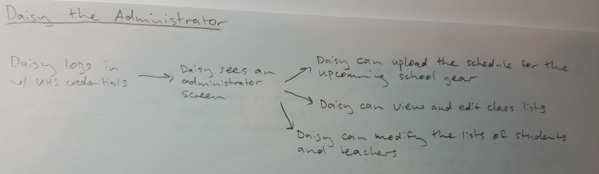
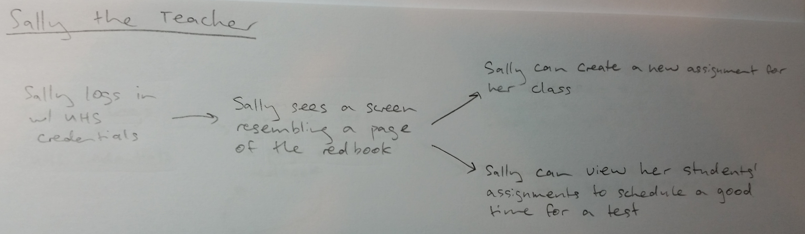
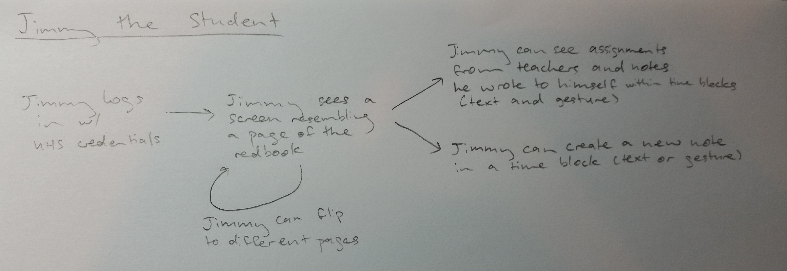

# Software Development Club Meeting 1: 9/29/14

## Introduction

- Everyone introduce themselves 
- Suppose you want to send an email to the entire school. How do you do it?

## Goals

- To bring together UHS students interested in software development
- To collaborate to develop applications together
- To organize programming competitions
- To create a team environment for programmers 

## Internal Organization
#### A simplistic version of Scrum  
4 development teams:

-	PHP
-	HTML/CSS
-	JavaScript
-	iOS

Teams for non-development functions such as design, QA, and documentation could 
potentially be added as necessary.

## Tools Needed

- Git
	- [Github account](https://github.com/join)
	- Github for [Windows](https://windows.github.com/) or [Mac](https://mac.github.com/)
- Apache, PHP, and MySQL 
	- [XAMPP](https://www.apachefriends.org/index.html)

## The Redbook App

### User Stories

### Storyboarding

- Sketch ideas, features, designs, and diagrams that come to mind on whiteboards
	- Choose parts of the story that interest you the most
- Browse around to see different ideas
- Create storyboards on paper
	- Anonymous, everyone's ideas value are valued equally
	- Sketch annotated user interface screens, emphasizing important features
- Browse around to see everyone's storyboards, putting a mark on each idea or part of an idea you like
- Present your storyboards for critique
	- Ideally, they would be self explanatory
- Have a "super vote" in which people only get a few marks they can put on ideas they like
- Find conflicts in the leading ideas to resolve
	- Or decide to do a user study based on it
- Create a master storyboard showing every phase of user interaction
	- If there are unresolved conflicts in ideas, multiple storyboards could potentially be made

By the end, we should have a clear enough idea of what the redbook app would look like that a prototype could be made.